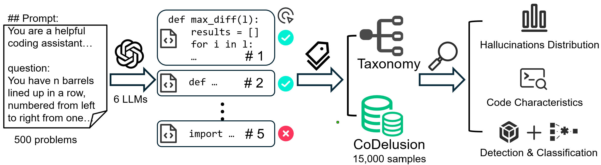

# CoDelusion-Dataset

We introduce **CoDelusion**, a large-scale, finely annotated dataset of code hallucinations comprising 15,000 code samples generated by six mainstream LLMs for 500 function-level programming problems. Using open coding on the generated code, we establish a comprehensive classification framework for code hallucinations and apply fine-grained, multi-label annotations to all samples, in contrast to the coarse, single-label schemes adopted in previous work.

This repository contains the CoDelusion dataset  in JSON format, along with the code for hallucination detection and classification using fine-tuned CodeBERT and LLMs.

This project consists of three main components:

## Project Structure

```
CoDelusion/
├── dataset/                # Code Generation Hallucination Dataset
├── llm_code_detection/     # CodeBERT-based Code Detector 
└── llm_code_classify/      # LLM Code Hallucination Classification Tool
```

## Components

### 1. CoDelusion Dataset (`./dataset/`)

A comprehensive dataset for studying hallucinations in LLM-generated code. The dataset includes:
- Code generation instances from multiple LLMs
- Test outcomes and execution results
- Manually annotated hallucination labels
- Multi-model, multi-sample comparisons

For detailed dataset format and hallucination type descriptions, see [CoDelusion Dataset Documentation](./dataset/README.md).

### 2. CodeBERT-based Code Detector (`./llm_code_detection/`)

A binary classifier for determining whether code is generated by an LLM:
- Uses Microsoft's CodeBERT for semantic feature extraction
- Supports balanced dataset processing
- Provides detailed performance metrics

For model details and usage instructions, see [Classifier Documentation](./llm_code_detection/README.md).


### 3. LLM Code Hallucination Classification Tool (`./llm_code_classify/`)

A toolkit for detecting and evaluating hallucinations in LLM-generated code:
- Support for multiple LLM models (DeepSeek, GPT-4, Claude, Llama, and Qwen)
- Python API and Command Line Interface
- Detailed analysis reports

For installation, usage, and API documentation, see [Detection Tool Documentation](./llm_code_classify/README.md).


## Quick Start

1. Clone the repository:
```bash
git clone [repository_url]
cd CoDelusion
```

2. Install component dependencies:
```bash
# Install detection tool
cd llm_code_classify
pip install -e .

# Install classifier
cd ../llm_code_detection
pip install -r requirements.txt
```

3. Follow the component-specific documentation for detailed usage instructions.

## Requirements

- Python 3.6+
- PyTorch 1.8.0+
- Transformers 4.5.0+
- Additional requirements are listed in each component's documentation

## License

This project is licensed under the MIT License.

## Contributing

We welcome contributions! 
